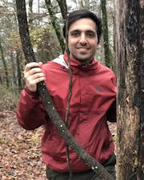

### Bio

My name is Ardalan and I am from Iran. I was born in Tehran where I also did my undergrad and master's studies. I studied Chemistry at Shahid Beheshti University (also known as National University prior to 1979). In 2013, I entered the master's program in Nano-Chemistry at Iran University of Science and Technology.
While growing up in large cities in Iran, our family managed to travel across the country. I have visited pretty much all parts of Iran with the exception of south-western parts. While working on my master's dissertation I traveled one last time with my family and visited pristine central parts of Iran.

{:class="img-responsive"}

    <h1>About me</h1>
    

        My name is Ardalan and I was born in Tehran, Iran, where I also did my undergraduate and master's studies. 
        I moved to the US in 2016 and currently, I'm in the 5th year of my studies at Oklahoma state university. 
        In my free time, I enjoy reading, playing chess and hiking.
    

     
    <h4>Acknowledgements</h4>
    
Many people have supported and helped me, I'd love to thank:
<ul>
    <li>Dr. Charles S. Weinert</li>
    <li>Dr. Floyd Shumaker</li>
    <li>Sarah Hayatifar</li>
    <li>Sina Khodabande Lou</li>
    <li>Saeed Farhadi</li>
    <li>Dr. Jon Day</li>
    <li>Eric Brinkman</li>
    <li>Dr. James Anderson</li>
    <li>Aaron Madden</li>
    <li>Dr. Chris Fennell</li>
    <li>Dr. Sangeetha Komanduri</li>
    <li>Miguel Leal</li>
    <li>Faramarz Moattar</li>
</ul>

    

<!--  -->
 
 
 
 
 
 
 
 

    <h5>Disclaimer</h5>
    
All views and opinions expressed on this website are my own and do not represent the opinions 
        of any entity whatsoever with which I have been, am now, or will be affiliated. 

    <h5>Fair Use and Content Disclaimer</h5>
    
This site is for educational purposes only.

    <h6>Fair Use</h6>
    
 Materials used in this website can be from articles published in scientific journals, and they are only intended for educational
        purposes (Please refer to “Section 107 of the Copyright Act of 1976”). 
    

